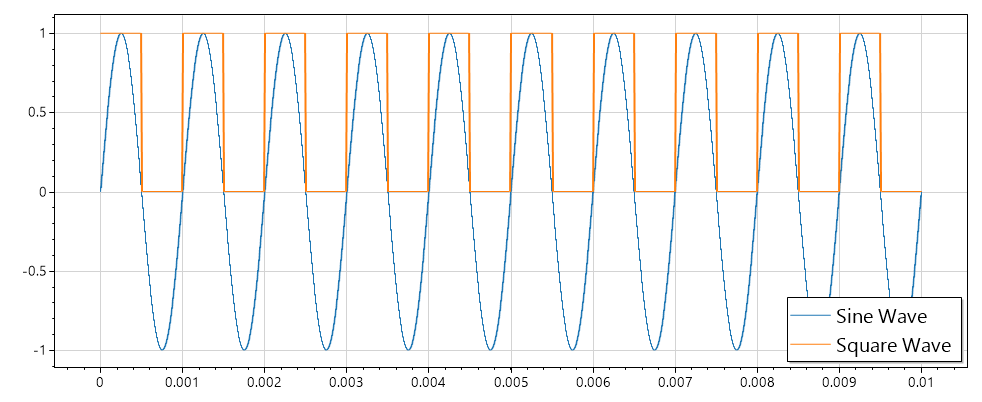

# WPlot
A WPF app for plotting stuff. The backend is provided by [ScottPlot](https://github.com/swharden/ScottPlot)

# Capabilities
- Scatter Plots
- Plotting functions in form `y=<expression>`
- Signal Plots
- Bar Plots, including Grouped Bar Plots
- Histogram
- Error Bars
- Linear Regression
- Customization
- Draw Vertical/Horizontal Lines or Spans

# Downloads
Compiled versions since `0.3.2` are available here: https://gist.github.com/Benny121221/b3106083c4375b931c179fae23a78682

Alternatively, download the compiled version from the releases page.

# Creating a Scatter Plot

Signal plots can be created in a similar way.

# Prefab Signal Plots
WPlot lets you use a couple premade signal plots, just plug in a frequency and hit OK.

## You can create a signal plot from your own data if you need. The process is nearly identical to a Scatter Plot

# Stacking Plots

# Easy Customization

Toggle gridlines, ticks, frame, or just choose a pretty theme:

You can also add labels or choose a logarithmic axis:

# Contribution
If you're feeling generous, feel free to put in a PR. This is all under the MIT License.

---

# Made by Where 1
